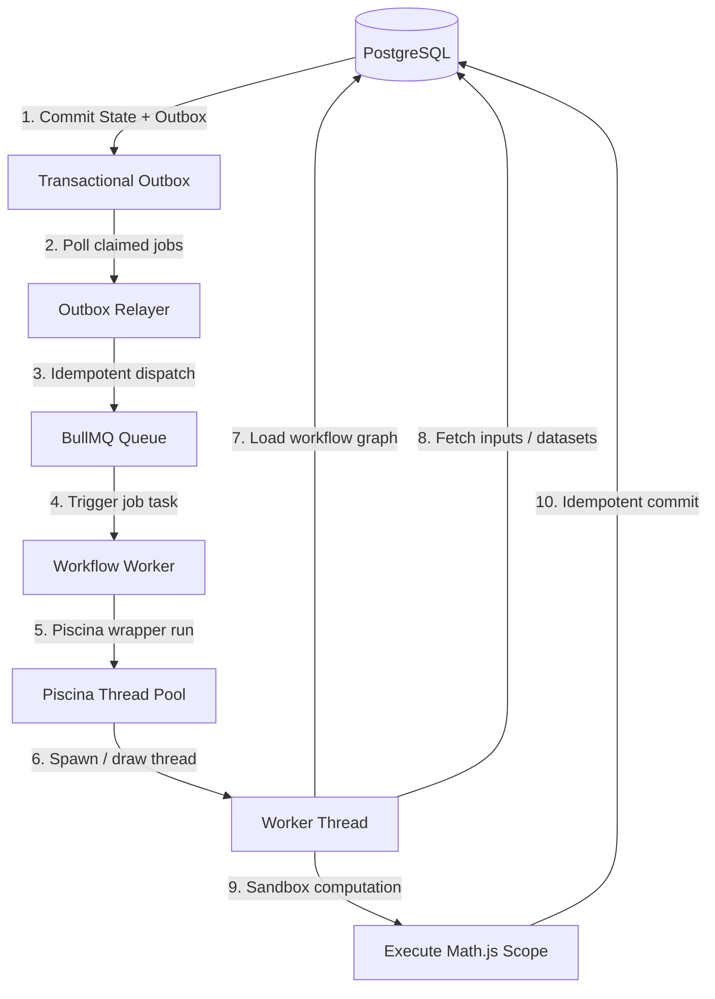

# Asynchronous Job, Transactional Outbox, & Piscina Worker Thread Infrastructure

This document is the definitive production-grade architectural guide for background execution, database-isolated Redis connectivity, the Transactional Outbox pattern, and resource-isolated worker threads in this system.

---

## 🏗️ 1. Complete System Architecture Flow

The workflow execution pipeline completely decouples database commits from background queue dispatch, and isolates compute-heavy user formulas inside worker threads managed via Piscina to prevent Node event-loop blockages:



---

## 🔌 2. Modular Redis Connection Factory (`src/lib/redis.ts` & `src/lib/bullmq.ts`)

To ensure maximum resilience and separation of concerns, the Redis architecture employs isolated logical databases. This prevents application caching operations from evicting background workers or critical user sessions.

### Logical Database Allocation Table
| Logical DB | Client Instance Name | Scope & Function | Custom Connection Settings |
| :--- | :--- | :--- | :--- |
| **DB 0** | `redisCacheClient` | Application-level cache, idempotency logs, step locks | Standard max attempts (3) |
| **DB 1** | `redisSessionClient` | Active user sessions, refresh tokens, security contexts | Standard max attempts (3) |
| **DB 2** | `redisQueueClient` | **BullMQ Queues & Workers** | `maxRetriesPerRequest: null` (Required) |
| **DB 3** | `rateLimitRedisClient` | API Rate-limiting counters | Standard max attempts (3) |

### ⚡ The BullMQ Connection Safety Override
BullMQ workers poll Redis using blocking commands (e.g. `BRPOPLPUSH`). Under default configurations, `ioredis` limits blocking retry durations, causing connection drops during idle periods.
* **The Solution**: The connection factory specifically overrides this behavior for **DB 2**, applying `maxRetriesPerRequest: null`. All other Redis clients retain strict retry constraints to prevent event-loop starvation during network partition incidents.
* **Backward Compatibility**: `src/lib/bullmq.ts` re-exports `redisQueueClient` as `redisConnection`. Existing legacy worker hooks automatically inherited these upgrades without modifying their internal code structures.

---

## 🔄 3. The Transactional Outbox Pattern

### 📁 A. The Database Schema (`OutboxJob`)
The database schema includes the `OutboxJob` model to track job states, failures, and retries.

```prisma
model OutboxJob {
  id           String       @id @default(cuid())
  queueName    String       // Target BullMQ queue (e.g., 'calc-execution')
  jobName      String       // Execution type (e.g., 'resume', 'start-background')
  payload      Json         // Strictly typed task arguments
  status       OutboxStatus @default(PENDING) // PENDING, PROCESSING, ENQUEUED, FAILED
  attemptCount Int          @default(0)        // Retries attempted
  lastError    String?      // Diagnostic log of the last failure
  nextRetryAt  DateTime?    // Exponential backoff timestamp threshold
  redisJobId   String?      // Reference to the resulting BullMQ Job in Redis
  enqueuedAt   DateTime?    // Logged timestamp of queue insertion
  createdAt    DateTime     @default(now())
  updatedAt    DateTime     @updatedAt

  @@index([status, nextRetryAt, createdAt]) // High-performance index optimized for polling
  @@index([status, updatedAt])              // High-performance index optimized for stuck-job watchdog recovery
}
```

> [!NOTE]  
> The indexes on `OutboxJob` are critical. The composite index `[status, nextRetryAt, createdAt]` allows the Outbox Relayer to instantly scan and claim pending/failed jobs without performing full-table scans. The index `[status, updatedAt]` ensures the watchdog recovery query is fully optimized.

---

### 🛡️ B. Production-Grade Queue Facade (`src/lib/queue-producers.ts`)
To isolate the business logic from direct imports of BullMQ queues, we created a **strictly-typed Facade pattern**. This acts as a protective boundary, ensuring:
1. **Strict Payload Verification**: PAYLOAD types (`CalcResumePayload`, `WorkflowExecutionPayload`, etc.) are validated at compile-time.
2. **Atomicity Guarantee**: Every method requires a `Prisma.TransactionClient` parameter, making it syntactically impossible for developers to enqueue jobs outside of an active database transaction.

```typescript
// Example usage in tRPC router or orchestrators:
await prisma.$transaction(async (tx) => {
  // 1. Perform database state updates
  await tx.calcSession.update({ ... });

  // 2. Schedule background job via Facade - fully atomic!
  await QueueProducer.dispatchCalcResume(tx, {
    sessionId: "session_abc123",
    reason: "user_triggered_calculation"
  });
});
```

---

## ⚙️ 4. The Outbox Relayer (`src/workers/outboxRelayer.ts`)

The **Outbox Relayer** is a dedicated background process responsible for polling `OutboxJob` records and enqueuing them onto their target BullMQ channels.

### 🚀 Key Technical Features

#### 1. High-Performance Horizontal Scalability (`FOR UPDATE SKIP LOCKED`)
To support multi-node containerized environments (e.g. Docker, Kubernetes clusters) without job duplication, the relayer fetches pending jobs using raw SQL:
```sql
WITH claimed AS (
  SELECT id FROM "OutboxJob"
  WHERE status = 'PENDING'
    AND ("nextRetryAt" IS NULL OR "nextRetryAt" <= NOW())
  ORDER BY "createdAt" ASC
  LIMIT 50
  FOR UPDATE SKIP LOCKED
)
UPDATE "OutboxJob"
SET status = 'PROCESSING', "updatedAt" = NOW()
WHERE id IN (SELECT id FROM claimed)
RETURNING id, "queueName", "jobName", payload, "attemptCount";
```
* **How it works**: The `FOR UPDATE SKIP LOCKED` clause locks the claimed rows for the duration of the current transaction. Concurrently running Relayer daemons ignore locked rows and grab the next available batch of 50 jobs. This prevents race conditions and maximizes throughput.

#### 2. Idempotent Dispatch & Exactly-Once Processing Semantics
BullMQ provides **at-least-once delivery semantics**. If a worker crashes immediately after running a task but before acknowledging, BullMQ will redeliver the job. To prevent data corruption, the system achieves **exactly-once processing semantics** through:

$$\text{At-Least-Once Queue Delivery} + \text{Idempotent Processing} = \text{Exactly-Once Processing Semantics}$$

*   **Job ID Mapping**: The PostgreSQL `OutboxJob.id` is explicitly passed as the BullMQ `jobId`:
    ```typescript
    await queue.add(job.jobName, job.payload, { jobId: job.id });
    ```
    Since BullMQ natively enforces unique job IDs inside Redis, any re-queue attempt of the same outbox job is ignored by Redis as a duplicate key.
*   **Execution Idempotency**: The worker layer uses the `executionId` as a unique cluster-wide idempotency key.
*   **Idempotent Execution Updates**: Persistent calculations must check state transitions to ensure that a finished execution cannot be modified or re-run by a delayed queue retry.

#### 3. Fault-Tolerant Exponential Backoff & Capped Retries
If the Redis cluster is temporarily offline, the Relayer updates the job status to `PENDING` and calculates a delayed retry execution window:
$$\text{delay} = \min(2^{\text{attemptCount}} \times 1000\text{ms},\ 5\text{ minutes})$$
* **Max Attempts**: If a job fails persistently for **20 attempts**, it is moved to `FAILED` and logged for developer intervention, preventing poison pill payloads from clogging the pipeline.

#### 4. Automatic Crash Watchdog Recovery
If the server container crashes midway through Relayer execution, claimed jobs remain locked in `PROCESSING` status indefinitely.
* **The Solution**: An automated watchdog runs every 60 seconds, recovering any jobs left in `PROCESSING` state for more than 5 minutes and returning them to `PENDING`:
  ```sql
  UPDATE "OutboxJob"
  SET status = 'PENDING', "updatedAt" = NOW()
  WHERE status = 'PROCESSING'
    AND "updatedAt" < NOW() - INTERVAL '5 minutes'
  ```
  *(Optimized by the `@@index([status, updatedAt])` schema index).*

---

## 🪵 5. The Specialized Background Workers (`src/workers/`)

The workers subscribe to individual logical queues mapped from `DB 2` and coordinate tasks. Crucially, they act as an **orchestration layer** and delegate heavy CPU mathematical work to isolated **Piscina worker threads** to maintain process stability.

```
                  +-----------------------------------+
                  |        Redis Database DB 2        |
                  +-----------------+-----------------+
                                    |
          +-----------------+-------+-------+-----------------+
          |                 |               |                 |
          v                 v               v                 v
   [calc-execution] [workflow-execution] [batch-process] [sweeper-queue]
          |                 |               |                 |
          v                 v               v                 v
    +-----------+     +-----------+   +-----------+     +-----------+
    |   Calc    |     | Workflow  |   |   Batch   |     |  Sweeper  |
    |  Worker   |     |  Worker   |   |  Worker   |     |  Worker   |
    +-----------+     +-----------+   +-----------+     +-----------+
          |                 |               |
          +--------+--------+---------------+
                   |
                   v
         +-------------------+
         | Piscina Pool      |  <-- Prevents Event Loop Blockage
         +---------+---------+
                   |
         +---------+---------+
         | Worker Thread     |  <-- Runs MathJS Sandboxed Scope
         +-------------------+
```

### 1. Calculation Session Worker (`calcWorker.ts`)
* **Queue**: `calc-execution`
* **Function**: Orchestrates calculations in multi-stage sessions. Loads execution metadata and delegates calculations to a Piscina worker thread. If the worker thread hits a slow or asynchronous node, it pauses execution and enqueues a `calc/session.resume` job.

### 2. Workflow Executor Worker (`workflowWorker.ts`)
* **Queue**: `workflow-execution`
* **Function**: The BullMQ worker acts as an orchestration layer. It loads execution metadata and delegates workflow execution to a Piscina worker thread. The worker thread:
  1. Loads the workflow definition directly from the database using `workflowId`.
  2. Loads execution inputs and variables directly using `executionId`.
  3. Performs topological sorting (`topologicalSort`) to determine node execution order.
  4. Runs each node through its matching sandboxed executor.
  5. Persists result states idempotently in PostgreSQL.

### 3. Batch Processor Worker (`batchWorker.ts`)
* **Queue**: `batch-process`
* **Function**: Acts as a batch orchestration coordinator. To avoid out-of-memory errors and main-thread blocks, work is chunked and executed sequentially within worker threads.
* **Option A Model (Enforced)**: A single batch execution request is locked to a single, dedicated worker thread. The worker thread loops through chunks sequentially (streaming and executing 100 rows at a time) to process the entire batch, preserving CPU isolation and memory limits without spawning concurrent threads.

### 4. Sweeper TTL Clean-up Worker (`sweeperWorker.ts`)
* **Queue**: `sweeper-queue`
* **Function**: Clocked Cron queue (executes hourly). Clean-up daemon that automatically marks abandoned execution sessions (`PENDING` > 6 hours or `PAUSED` > 30 days) as `TIMED_OUT`.

---

## 🧵 6. Worker Thread Runtime & Boundary Rules

Executing user calculation expressions or sandboxed code blocks inside the main process event loop is completely prohibited:

> [!CAUTION]  
> **Forbidden Boundary Violation**:
> $$\text{BullMQ Worker Process} \rightarrow \text{Direct MathJS Execution (Main Thread)} \quad \text{[BANNED]}$$

User calculation expressions or sandboxed code blocks must **never** be executed inside the main process event loop.

> [!TIP]  
> **Required Execution Pipeline**:
> $$\text{BullMQ Worker Process} \rightarrow \text{Piscina Pool Manager} \rightarrow \text{Worker Thread} \rightarrow \text{MathJS Sandboxed Eval} \quad \text{[MANDATORY]}$$

Every workflow execution is isolated from the Node.js main event loop by running inside a Piscina worker thread drawn from the pool.

---

### 🔌 A. Thread Boundary Rules (Identifiers Only)
To minimize message-passing overhead and memory pressure under high concurrency, we enforce a strict **lightweight messaging policy** across the thread boundary.

> [!IMPORTANT]  
> **Rule**: Do not pass heavy datasets, large matrices, raw execution state JSON blobs, or complex visual graphs through the Piscina message-passing interface. Only pass identifiers.

*   **Before (Anti-Pattern - Causes GC Pressure)**:
    ```typescript
    await piscina.run({
      workflowId,
      executionId,
      inputs, // Heavy JSON payload containing matrices/rows
    });
    ```
*   **After (Standardized - High Performance)**:
    ```typescript
    await piscina.run({
      workflowId,
      executionId,
    });
    ```
*   **Allowed across boundary**:
    *   `workflowId` (string)
    *   `executionId` (string)
    *   `sessionId` (string)
*   **Forbidden across boundary**:
    *   Large matrices
    *   Workflow graphs
    *   Batch datasets
    *   Execution state snapshots
*   **Enforcement**: Worker threads must load their required graphs, variables, and data payloads directly from PostgreSQL or the persistent caching layer.

---

### 🛡️ B. Worker Failure Isolation & Timeout Actions
Piscina worker crashes or execution timeouts must never terminate BullMQ worker processes or cause the main API server to halt.
*   **Required Try/Catch Guard**: Every Piscina invocation must be wrapped in a `try/catch` block.
    ```typescript
    try {
      await piscina.run({
        executionId,
        workflowId,
      });
    } catch (error) {
      await handleExecutionError(executionId, error);
    }
    ```
*   **Thread Timeout Execution Flow (30 Seconds)**:
    If a calculation execution exceeds the configured timeout:
    1.  **Mark execution as FAILED** in PostgreSQL with a `TIMEOUT_EXPIRED` diagnostic error.
    2.  **Terminate the worker task** to immediately release worker threads back to the pool.
    3.  **Release the BullMQ worker process** so it is free to grab the next queue items.
    4.  **Record timeout diagnostics** (e.g. current node and elapsed stats) to stdout logs.

---

### 💾 C. Execution & Persistence Idempotency
To prevent data duplication in case of worker crashes after a DB commit but before a queue acknowledgment, all database persistence operations must be fully idempotent.

*   **Uniqueness Constraints**:
    Database tables enforce strict constraints to handle conflicts cleanly via `ON CONFLICT DO UPDATE`:
    ```sql
    UNIQUE(executionId)         -- Unique constraint on execution summaries
    UNIQUE(executionId, nodeId)  -- Unique constraint on step-by-step outcomes
    ```
*   **Payload Size Persistence Routing Recommendation**:
    We divide persistence routing based on payload sizes to optimize memory usage:

| Output Payload Size | Recommended Path | Execution Flow |
| :--- | :--- | :--- |
| **Large Outputs** (e.g. matrices, CSV data, heavy JSON) | **Direct Worker Write** | Worker Thread $\rightarrow$ Direct DB Write |
| **Small Outputs** (e.g. status keys, small scalars) | **Returned Output** | Worker Thread $\rightarrow$ Return to BullMQ Worker $\rightarrow$ BullMQ Worker Writes |

---

### 🔒 D. Expression Safety & Curated Evaluation Scope
Arbitrary user calculation formulas are processed inside a highly restricted, curated MathJS evaluation scope inside the worker thread.

*   **Curated MathJS Scope**:
    Math.js itself is **not** a secure virtual machine sandbox and does not provide CPU, process, or memory isolation. **The parent Node OS Worker Threads provide the actual process and memory isolation boundary**. Math.js is strictly used to enforce a restricted, curated namespace of exposed symbols.
*   **Approved Whitelist of Symbols**:
    Only pure mathematical, logical, and array manipulation helpers are exposed:
    `sqrt`, `pow`, `log`, `sin`, `cos`, `multiply`, `divide`, etc.
*   **Forbidden Operations (Exposed Blacklist)**:
    Access to system files, imports, package inclusion, and dynamic module creation are completely blocked:
    `import`, `createUnit`, dynamic extensions.
*   **Workflow Runtime Limits**:
    Even with sandboxing, we enforce operational limits to prevent denial-of-service attempts:
    *   **Maximum Execution Time**: Enforce a strict execution window (e.g., 30 seconds default).
    *   **Maximum Matrix Size**: Throws a size error if matrix dimensions exceed `MAX_ELEMENTS = 1,000,000` (prevents memory blowup).
    *   **Maximum Node Count**: Configurable limit to check workflow depth.
    *   **Memory Protection**: Memory usage is monitored and protected through matrix-size limits, workflow limits, and process-level resource controls. Individual worker threads cannot reliably enforce memory limits internally.

---

### 🛑 E. Cancellation Semantics
Workflow execution cancellation is **cooperative**, meaning calculations check for cancellation states at logical boundaries.

*   **Node-Boundary Cancellation**: The engine queries cancellation states before launching a node's execution.
*   **Batch Chunk Cancellation**: For batch executions, cancellation checks occur before grabbing the next data chunk.
*   **Guarantees**: While a single expensive mathematical operation (e.g., large matrix multiplication) might not be instantly interruptible, the workflow will stop immediately at the very next node or chunk boundary.
*   **Cancellation Check Trigger Locations**:
    1.  Before next node execution.
    2.  Before next batch chunk execution.
    3.  Before resuming a paused execution.

---

## 🏎️ 7. Piscina Pool Configuration & Thread Reuse

To prevent severe thread creation overhead, CPU thrashing, and context-switching bottlenecks, we utilize Piscina's core thread reuse design. 

### 🔄 Thread Reuse Mechanics
Piscina worker threads are persistent and drawn from the thread pool. A single worker thread is kept alive and reused across its lifetime—executing `Workflow A`, then `Workflow B`, then `Workflow C` sequentially as tasks arrive in the queue. 

### 📐 Sizing Configurations
Piscina pools must be scaled according to the host system's hardware specifications:

```typescript
const poolConfig = {
  minThreads: 2,
  maxThreads: Math.max(2, os.cpus().length), // Draw up to available physical/logical cores
};
```

| Host CPU Cores | Sizing Policy (`min` $\rightarrow$ `max`) | Recommended Target |
| :--- | :--- | :--- |
| **4-Core Host** | 2 $\rightarrow$ 4 | **4 Threads max** |
| **8-Core Host** | 2 $\rightarrow$ 8 | **8 Threads max** |
| **16-Core Host** | 2 $\rightarrow$ 16 | **16 Threads max** |

> [!WARNING]  
> Avoid over-allocating threads (e.g., configuring `maxThreads: 100` on a 4-core machine). Over-allocation forces high context-switching overhead, triggers CPU thrashing, and significantly degrades overall calculation throughput.

---
*Document author: Antigravity AI Engine (Pair Programming Session)*
