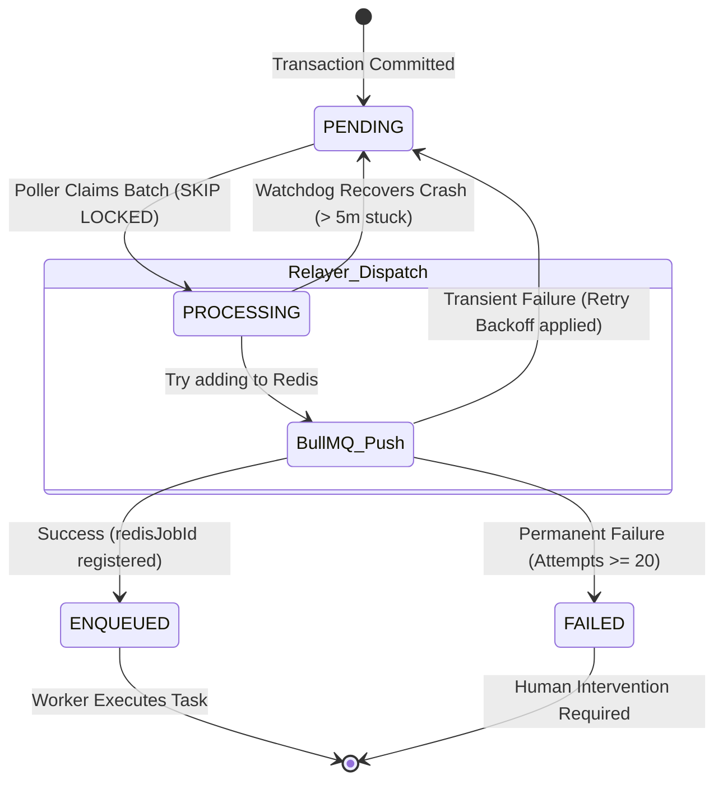

# Asynchronous Job & Transactional Outbox Infrastructure Memory

This document provides a comprehensive blueprint of the decoupled, highly scalable, and 100% reliable background execution architecture implemented in this codebase. It explains how **Redis**, **BullMQ**, and the **Transactional Outbox Pattern** cooperate to guarantee absolute data consistency across all engineering calculations and batch workflow processes.

---

## 🏗️ 1. Architecture Overview

To achieve bulletproof durability, we decoupled database writes from external job queuing. In high-scale distributed systems, pushing a job directly to Redis (`BullMQ`) within a database transaction is an anti-pattern. If the database transaction rolls back, the job will still execute. Conversely, if Redis fails, the transaction fails. 

The **Transactional Outbox Pattern** solves this. When an execution event occurs, the server saves the business state AND writes a corresponding task payload as an `OutboxJob` inside the **same PostgreSQL transaction**. A dedicated background daemon—the **Outbox Relayer**—constantly polls PostgreSQL for these jobs, publishes them to Redis/BullMQ, and updates their state.

```
+-----------------------------------------------------------------------------------+
|                            [ POSTGRESQL TRANSACTION ]                              |
|                                                                                   |
|  1. Business Write: Update CalcSession / workflow state                           |
|  2. Outbox Write:   Create OutboxJob (status = 'PENDING')                         |
+------------------------------------------+----------------------------------------+
                                           | (Guaranteed Atomic Commit)
                                           v
                                   [ PostgreSQL DB ]
                                           |
                                           | (FOR UPDATE SKIP LOCKED)
                                           v
                             +---------------------------+
                             |   Outbox Relayer Daemon   |
                             +-------------+-------------+
                                           | (Idempotent push with jobId = OutboxJob.id)
                                           v
                                   [ Redis (DB 2) ]
                                           |
                                           v
                                   [ BullMQ Workers ]
                             (calc, workflow, batch, sweeper)
```

---

## 🔌 2. Modular Redis Connection Factory (`src/lib/redis.ts` & `src/lib/bullmq.ts`)

To ensure maximum resilience and separation of concerns, the Redis architecture employs isolated logical databases. This prevents application caching operations from evicting background workers or critical user sessions.

### Key Database Allocations
| Logical DB | Client Instance Name | Scope & Function | Custom Connection Settings |
| :--- | :--- | :--- | :--- |
| **DB 0** | `redisCacheClient` | Application-level cache, idempotency logs, step locks | Standard max attempts (3) |
| **DB 1** | `redisSessionClient` | Active user sessions, refresh tokens, security contexts | Standard max attempts (3) |
| **DB 2** | `redisQueueClient` | **BullMQ Queues & Workers** | `maxRetriesPerRequest: null` (Required) |
| **DB 3** | `rateLimitRedisClient` | API Rate-limiting counters | Standard max attempts (3) |

### ⚡ The BullMQ connection Safety Override
BullMQ workers poll Redis using blocking commands (e.g. `BRPOPLPUSH`). Under default configurations, `ioredis` limits blocking retry durations, causing connection drops during idle periods. 
* **The Solution**: The connection factory specifically overrides this behavior for **DB 2**, applying `maxRetriesPerRequest: null`. All other Redis clients retain strict retry constraints to prevent event-loop starvation during network partition incidents.
* **Backward Compatibility**: `src/lib/bullmq.ts` re-exports `redisQueueClient` as `redisConnection`. Existing legacy worker hooks automatically inherited these upgrades without modifying their internal code structures.

---

## 🔄 3. The Transactional Outbox Pattern

### 📁 A. The Database Schema (`OutboxJob`)
The database schema includes the `OutboxJob` model to track job states, failures, and retries.

```prisma
model OutboxJob {
  id           String       @id @default(cuid())
  queueName    String       // Target BullMQ queue (e.g., 'calc-execution')
  jobName      String       // Execution type (e.g., 'resume', 'start-background')
  payload      Json         // Strictly typed task arguments
  status       OutboxStatus @default(PENDING) // PENDING, PROCESSING, ENQUEUED, FAILED
  attemptCount Int          @default(0)        // Retries attempted
  lastError    String?      // Diagnostic log of the last failure
  nextRetryAt  DateTime?    // Exponential backoff timestamp threshold
  redisJobId   String?      // Reference to the resulting BullMQ Job in Redis
  enqueuedAt   DateTime?    // Logged timestamp of queue insertion
  createdAt    DateTime     @default(now())
  updatedAt    DateTime     @updatedAt

  @@index([status, nextRetryAt, createdAt]) // High-performance index optimized for polling
}
```

> [!NOTE]  
> The index `@@index([status, nextRetryAt, createdAt])` is critical. It allows the Outbox Relayer to instantly scan and claim pending/failed jobs without performing heavy full-table scans.

---

### 🛡️ B. Production-Grade Queue Facade (`src/lib/queue-producers.ts`)
To isolate the business logic from direct imports of BullMQ queues, we created a **strictly-typed Facade pattern**. This acts as a protective boundary, ensuring:
1. **Strict Payload Verification**: PAYLOAD types (`CalcResumePayload`, `WorkflowExecutionPayload`, etc.) are validated at compile-time.
2. **Atomicity Guarantee**: Every method requires a `Prisma.TransactionClient` parameter, making it syntactically impossible for developers to enqueue jobs outside of an active database transaction.

```typescript
// Example usage in tRPC router or orchestrators:
await prisma.$transaction(async (tx) => {
  // 1. Perform database state updates
  await tx.calcSession.update({ ... });

  // 2. Schedule background job via Facade - fully atomic!
  await QueueProducer.dispatchCalcResume(tx, {
    sessionId: "session_abc123",
    reason: "user_triggered_calculation"
  });
});
```

---

## ⚙️ 4. The Outbox Relayer (`src/workers/outboxRelayer.ts`)

The **Outbox Relayer** is a dedicated background process responsible for polling `OutboxJob` records and enqueuing them onto their target BullMQ channels.

### 🚀 Key Technical Features

#### 1. High-Performance Horizontal Scalability (`FOR UPDATE SKIP LOCKED`)
To support multi-node containerized environments (e.g. Docker, Kubernetes clusters) without job duplication, the relayer fetches pending jobs using raw SQL:
```sql
WITH claimed AS (
  SELECT id FROM "OutboxJob"
  WHERE status = 'PENDING'
    AND ("nextRetryAt" IS NULL OR "nextRetryAt" <= NOW())
  ORDER BY "createdAt" ASC
  LIMIT 50
  FOR UPDATE SKIP LOCKED
)
UPDATE "OutboxJob"
SET status = 'PROCESSING', "updatedAt" = NOW()
WHERE id IN (SELECT id FROM claimed)
RETURNING id, "queueName", "jobName", payload, "attemptCount";
```
* **How it works**: The `FOR UPDATE SKIP LOCKED` clause locks the claimed rows for the duration of the current transaction. Concurrently running Relayer daemons ignore locked rows and grab the next available batch of 50 jobs. This prevents race conditions and maximizes throughput.

#### 2. Guaranteed Exactly-Once Delivery (Idempotency Mapping)
If the Relayer successfully pushes a job to Redis but crashes *before* it can update the job status in PostgreSQL, a potential double-dispatch arises. 
* **The Solution**: We assign the PostgreSQL `OutboxJob.id` as the **BullMQ Job ID**:
  ```typescript
  await queue.add(job.jobName, job.payload, { jobId: job.id });
  ```
  Since BullMQ natively enforces uniqueness on Job IDs inside Redis, any repeated push attempts of the same `OutboxJob.id` are safely ignored as duplicate keys, guaranteeing **exactly-once execution**.

#### 3. Fault-Tolerant Exponential Backoff & Capped Retries
If the Redis cluster is temporarily offline, the Relayer updates the job status to `PENDING` and calculates a delayed retry execution window:
$$\text{delay} = \min(2^{\text{attemptCount}} \times 1000\text{ms},\ 5\text{ minutes})$$
* **Max Attempts**: If a malformed payload fails persistently for **20 attempts**, it is moved to `FAILED` and logged for developer intervention, preventing poison pill payloads from clogging the pipeline.

#### 4. Automatic Crash Watchdog Recovery
If the server container crashes midway through Relayer execution, claimed jobs remain locked in `PROCESSING` status indefinitely.
* **The Solution**: An automated watchdog runs every 60 seconds, recovering any jobs left in `PROCESSING` state for more than 5 minutes and returning them to `PENDING`:
  ```sql
  UPDATE "OutboxJob"
  SET status = 'PENDING', "updatedAt" = NOW()
  WHERE status = 'PROCESSING'
    AND "updatedAt" < NOW() - INTERVAL '5 minutes'
  ```

---

## 🪵 5. The Specialized Background Workers (`src/workers/`)

The workers subscribe to individual logical queues mapped from `DB 2` and process tasks asynchronously:

```
                  +-----------------------------------+
                  |        Redis Database DB 2        |
                  +-----------------+-----------------+
                                    |
          +-----------------+-------+-------+-----------------+
          |                 |               |                 |
          v                 v               v                 v
   [calc-execution] [workflow-execution] [batch-process] [sweeper-queue]
          |                 |               |                 |
          v                 v               v                 v
    +-----------+     +-----------+   +-----------+     +-----------+
    |   Calc    |     | Workflow  |   |   Batch   |     |  Sweeper  |
    |  Worker   |     |  Worker   |   |  Worker   |     |  Worker   |
    +-----------+     +-----------+   +-----------+     +-----------+
```

### 1. Calculation Session Worker (`calcWorker.ts`)
* **Queue**: `calc-execution`
* **Function**: Executes mathematical calculations in multi-stage sessions. Supports non-blocking paused flows. If calculations hit slow or asynchronous nodes, it registers a `calc/session.resume` job and pauses execution to process on next tick.

### 2. Workflow Executor Worker (`workflowWorker.ts`)
* **Queue**: `workflow-execution`
* **Function**: Standard workflow execution. Creates an `Execution` log, generates a dependency graph, sorts nodes topologically via `topologicalSort`, runs executors sequentially, and writes result states.

### 3. Batch Processor Worker (`batchWorker.ts`)
* **Queue**: `batch-process`
* **Function**: Runs heavy calculations (e.g. executing workflows over thousands of input records). Employs memory protection by caching formulas beforehand and streaming updates in chunks of 50 inside database transactions.

### 4. Sweeper TTL Clean-up Worker (`sweeperWorker.ts`)
* **Queue**: `sweeper-queue`
* **Function**: Clocked Cron queue (executes hourly). Clean-up daemon that automatically marks abandoned execution sessions (`PENDING` > 6 hours or `PAUSED` > 30 days) as `TIMED_OUT`.

---

## 📊 6. Job Lifecycle & State Transitions

An `OutboxJob` transitions through the following statuses during its processing lifecycle:



| Outbox Status | Description | System Behavior |
| :--- | :--- | :--- |
| **`PENDING`** | Job is written to DB. Ready for processing. | Checked by the Outbox Relayer's polling interval loop. |
| **`PROCESSING`** | Claimed by an active Relayer node. | Rows are locked via `FOR UPDATE` so concurrent relayers ignore them. |
| **`ENQUEUED`** | Successfully pushed to BullMQ/Redis DB 2. | Enqueued timestamp and BullMQ `jobId` are recorded for logging. |
| **`FAILED`** | Failed persistently after 20 retries. | Poller stops querying this row. Requires administrative analysis. |

---

## 🛠️ 7. Verification & Operations Command Guide

Use these queries and tools to monitor and troubleshoot the Outbox and Worker subsystems.

### 1. View Current Outbox Health & Queue Backlogs
Monitor the distribution of jobs across queues to verify the system is draining smoothly:
```sql
SELECT status, "queueName", COUNT(*), MIN("createdAt") AS oldest_job 
FROM "OutboxJob" 
GROUP BY status, "queueName" 
ORDER BY status;
```

### 2. Inspect Blocked or Failed Jobs
Identify payloads causing repeated failures:
```sql
SELECT id, "queueName", "jobName", "attemptCount", "lastError", "nextRetryAt", "createdAt"
FROM "OutboxJob"
WHERE status = 'FAILED' OR ("status" = 'PENDING' AND "attemptCount" > 0)
ORDER BY "updatedAt" DESC
LIMIT 10;
```

### 3. Recover Stuck Failed Jobs for Reprocessing
To force reprocessing of a failed job, reset its status, attempt count, and retry delay:
```sql
UPDATE "OutboxJob" 
SET status = 'PENDING', "attemptCount" = 0, "nextRetryAt" = NOW() 
WHERE id = 'job_id_here';
```

### 4. Observe Logging Logs
Background daemons emit high-observability tags to stdout. Watch server output for these markers:
* `[OutboxRelayer] Claimed X jobs to dispatch` — Relayer active.
* `[Redis] bullmq client connected (DB 2)` — Worker connection pool initialized successfully.
* `[OutboxRelayer Watchdog] Recovered X stuck PROCESSING job(s)` — Crash-recovery running.

---
*Document author: Antigravity AI Engine (Pair Programming Session)*
