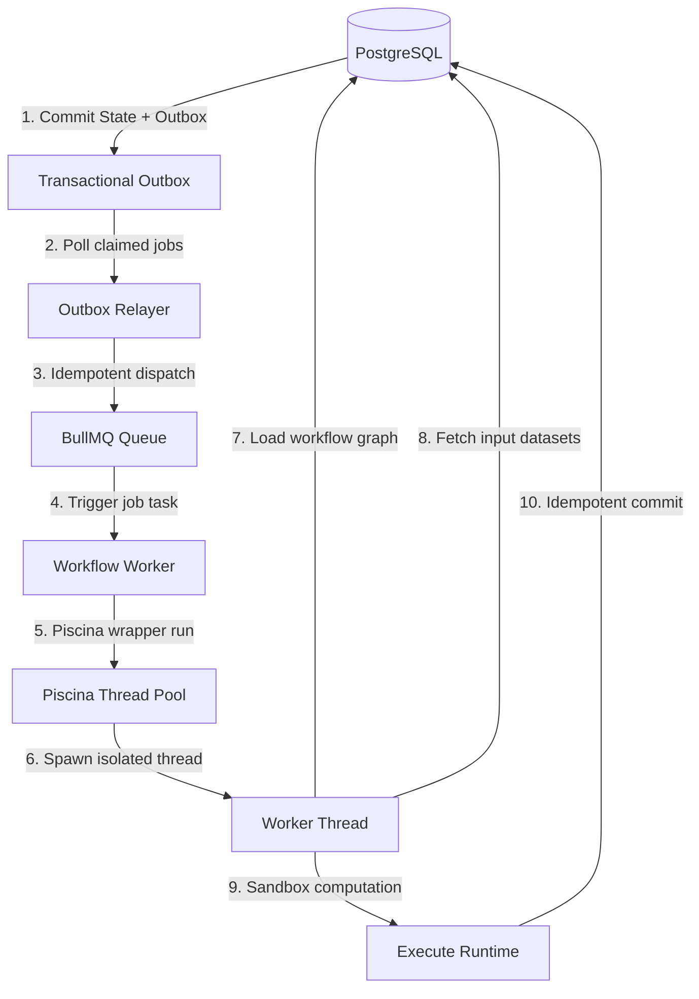

# Workflow Execution Strategy & Architectural Amendments

This document registers the official architectural amendments and requirements for executing visual engineering workflows in this system. It details the safety boundaries, threading policies, resource isolation guarantees, and failure-handling strategies.

---

## 🏗️ 1. Final Integrated Architecture Flow

The workflow execution pipeline is decoupled and isolated at every stage to achieve high throughput, fault tolerance, and event-loop protection:



---

## 📐 2. The Eight Architectural Pillars

### 🔌 1. The Thread Boundary Rule (Identifiers Only)
To minimize message-passing overhead and memory pressure under high concurrency, we enforce a strict **lightweight messaging policy** across the thread boundary.

> [!IMPORTANT]  
> **Rule**: Do not pass heavy datasets, large matrices, raw execution state JSON blobs, or complex visual graphs through the Piscina message-passing interface. Only pass identifiers.

*   **Before (Anti-Pattern)**:
    ```typescript
    await piscina.run({
      workflowId,
      executionId,
      inputs, // Heavy JSON payload containing matrices/rows
    });
    ```
*   **After (Standardized)**:
    ```typescript
    await piscina.run({
      workflowId,
      executionId,
    });
    ```
*   **Worker Thread Flow**:
    ```
    Worker Thread Spawns 
        ↓ 
    Loads Workflow Graph (from DB using workflowId)
        ↓ 
    Loads Inputs / Datasets (from DB using executionId)
        ↓ 
    Executes Calculations
    ```
*   **Why**: Large cloned messages trigger significant structured clone serialization overhead, spike garbage collection pressure, and can starve Node’s event loop during peak execution loads.

---

### 🔄 2. Idempotent Processing Semantics
While BullMQ guarantees **At-Least-Once Delivery** (ensuring jobs are never lost, even if workers restart mid-execution), the application layer must turn this into **Exactly-Once Processing Semantics**.

$$\text{At-Least-Once Queue Delivery} + \text{Idempotent Processing} = \text{Exactly-Once Processing Semantics}$$

*   **Global Idempotency Key**: Every workflow execution must carry a distinct `executionId` that serves as the unique cluster-wide idempotency key.
*   **Deterministic State Transitions**: State checks must ensure that a completed or terminal execution cannot be re-run or overwritten by a duplicate or delayed queue retry.

---

### 💾 3. Persistence Strategy & Conflict Resolution
The worker thread's writing operations must be fully idempotent. Repeated executions of the same workflow node or session must update the existing records rather than appending duplicate rows.

*   **Database Level Protection**: We enforce strict uniqueness constraints to handle conflict resolution cleanly via `ON CONFLICT DO UPDATE`:
    ```sql
    UNIQUE(executionId)        -- For session-level summary stats
    UNIQUE(executionId, nodeId) -- For individual step outputs
    ```
*   **Payload Size Routing Recommendation**:
    We divide persistence routing based on payload sizes to optimize memory usage:

| Output Payload Size | Recommended Path | Execution Flow |
| :--- | :--- | :--- |
| **Large Outputs** (e.g. matrices, CSV data, heavy JSON) | **Direct Worker Write** | Worker Thread $\rightarrow$ Direct DB Write |
| **Small Outputs** (e.g. status keys, small scalars) | **Returned Output** | Worker Thread $\rightarrow$ Return to BullMQ Worker $\rightarrow$ BullMQ Worker Writes |

---

### 🛡️ 4. Worker Failure Isolation
Worker thread crashes or math execution failures inside Piscina must be isolated to prevent main server thread termination or BullMQ queue stalling.

*   **Protected Wrapper Rule**: Every invocation of `piscina.run()` must be wrapped in a robust, type-guarded `try/catch` block.
    ```typescript
    try {
      await piscina.run({
        executionId,
        workflowId,
      });
    } catch (error: any) {
      console.error(`[Worker Failure] Workflow execution ${executionId} crashed:`, error);
      await markExecutionFailed(executionId, error.message || String(error));
    }
    ```
*   **Guarantees**: The crash or execution failure of a single user's mathematical formulas must never impact:
    1.  The primary HTTP/tRPC API Server.
    2.  The parent BullMQ Queue Relayers or Workers.
    3.  Other concurrently running engineering workflows.

---

### 🔒 5. Expression Safety & Sandboxing Model
Arbitrary calculation formulas are processed inside a highly restricted sandboxed MathJS virtual environment inside the worker thread.

*   **Exposed approved functions list (Whitelist)**:
    Only pure mathematical, logical, and array manipulation helpers are allowed:
    `sqrt`, `pow`, `log`, `sin`, `cos`, `multiply`, `divide`, etc.
*   **Forbidden Capabilities (Blacklist)**:
    Access to system files, imports, package inclusion, and dynamic module creation are completely blocked:
    `import`, `createUnit`, dynamic JavaScript code extensions.
*   **Strict Runtime Limits**:
    Even with sandboxing, we enforce operational limits inside `safeEvaluate` to prevent denial-of-service attempts:
    *   **Maximum Node Count**: Limits the size of execution paths.
    *   **Maximum Matrix Size**: Throws a size error if matrix dimensions exceed `MAX_ELEMENTS = 1,000,000`.
    *   **Maximum Memory Consumption**: Prevents heap allocation failures.
    *   **Maximum Execution Time**: Enforces a strict execution window (e.g., 30 seconds default), terminating the thread if exceeded.

---

### 📊 6. Batch Processing Clarification
For heavy computations (e.g., running a workflow over thousands of rows of custom spreadsheet datasets):

$$\text{1 Workflow Execution Request} = \text{1 Worker Thread}$$

*   **Single-Thread Context**: An entire batch job, regardless of row count, is locked to a single, dedicated worker thread.
*   **Internal Chunking Optimization**: The worker thread internally chunks the dataset (e.g., streaming and executing 100 rows at a time) to protect memory:
    ```
    Fetch 100 rows 
        ↓ 
    Execute Formulas 
        ↓ 
    Idempotently Persist Outputs 
        ↓ 
    Fetch next 100 rows
    ```
*   **Important**: Chunking is an internal processing technique. Chunking does **NOT** map to multiple BullMQ jobs or create distributed Redis work items unless explicitly designed that way for that specific queue.

---

### 🛑 7. Cooperative Cancellation Semantics
Workflow execution cancellation is **cooperative**, meaning calculations check for cancellation states at logical boundaries.

*   **Node-Boundary Cancellation**: The engine queries cancellation states before launching a node's execution:
    ```
    [ Node A Execution ]
            ↓
    Check cancellation state (Bailed? -> Stop execution)
            ↓
    [ Node B Execution ]
            ↓
    Check cancellation state (Bailed? -> Stop execution)
    ```
*   **Batch Chunk Cancellation**: For batch executions, cancellation checks occur before grabbing the next data chunk.
*   **Guarantees**: While a single expensive mathematical operation (e.g., large matrix multiplication or recursive calculations) might not be instantly interruptible, the workflow will stop immediately at the very next node or chunk boundary.

---

### 🛡️ 8. Dedicated Process Resource Isolation
To protect Node's Event Loop and guarantee server responsiveness under compute-heavy scenarios, we enforce a strict process separation boundary.

> [!CAUTION]  
> **Forbidden Boundary Violation**:
>
> $$\text{BullMQ Worker Process} \rightarrow \text{Direct MathJS Execution (Main Thread)} \quad \text{[BANNED]}$$

User calculation expressions or sandboxed code blocks must **never** be executed inside the main process event loop.

> [!TIP]  
> **Required Execution Pipeline**:
>
> $$\text{BullMQ Worker Process} \rightarrow \text{Piscina Pool Manager} \rightarrow \text{Worker Thread} \rightarrow \text{MathJS Sandboxed Eval} \quad \text{[MANDATORY]}$$

Every calculation executes inside a dedicated Node OS thread managed by `Piscina`. This shields the main process, ensuring the web application and API routers remain highly responsive.

---
*Document author: Antigravity AI Engine (Pair Programming Session)*
