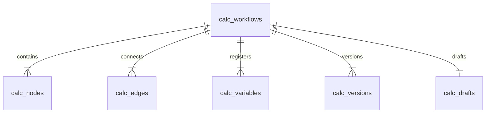
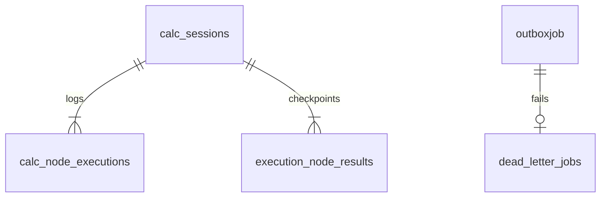

# Database Mapping Guide: Creation vs. Execution

This guide maps the database models (PostgreSQL tables and Redis logical databases) to their exact roles during the two lifecycle phases of a calculation workflow: **Workflow Creation & Design** and **Workflow Execution & Run**.

---

## 🎨 Phase 1: Workflow Creation & Design (Design Time)

When a developer builds, links, or publishes a workflow on the canvas, the following PostgreSQL tables store the structural state.

### 1. `calc_workflows` (Model: `CalcWorkflow`)

* **Purpose**: The central metadata record for a workflow.
* **What it saves**:
  * Workflow title, slug, descriptive tags, and category classification.
  * `canvasState`: A JSON block storing high-level canvas layout configurations (zoom level, background grid settings).
  * `status`: Enum (`DRAFT`, `PUBLISHED`, `ARCHIVED`, `DEPRECATED`).
  * `visibility`: Controls read permissions (`PRIVATE`, `PUBLIC`).

### 2. `calc_nodes` (Model: `CalcNode`)

* **Purpose**: Represents every building block on the workflow canvas.
* **What it saves**:
  * `type`: The node handler type (e.g., `INPUT`, `FORMULA`, `DECISION`, `API_CALL`, `PDF_REPORT`).
  * `label` and `description`: The node name and details shown to users.
  * `positionX` & `positionY`: Coordinates on the ReactFlow canvas.
  * `config`: A rich JSON block containing internal configs (e.g., for `FORMULA`, it stores the inline MathJS expression or the reference ID of a registry formula).

### 3. `calc_edges` (Model: `CalcEdge`)

* **Purpose**: Models the connections routing data from one node to another.
* **What it saves**:
  * `sourceHandle` & `targetHandle`: Identifies which ports are linked (e.g. output variable bound to an input parameter).
  * `condition`: A JSON constraint defining conditional routing logic (used by `DECISION` nodes to determine path splits).

### 4. `calc_variables` (Model: `CalcVariable`)

* **Purpose**: Tracks all inputs, intermediate outcomes, and final results declared in the workspace.
* **What it saves**:
  * `dataType`: Variable format (e.g., `NUMBER`, `STRING`, `BOOLEAN`, `ARRAY`, `OBJECT`).
  * `contextKey`: The unique identifier in the JSON engine environment (e.g., `house_area`).
  * `notation`: The algebraic key used in equations (e.g., `A`).
  * `defaultValue` & `constraints`: Boundaries and fallback values.

### 5. `calc_drafts` (Model: `CalcDraft`) and `calc_versions` (Model: `CalcVersion`)

* **`calc_drafts`**: Stores auto-saved, un-published canvas snapshots so a builder doesn't lose work on window close.
* **`calc_versions`**: Stores immutable JSON snapshots of the entire workflow structure (nodes, edges, variable binds) mapped to version numbers (1, 2, 3...) when published.

---

## ⚡ Phase 2: Workflow Execution (Runtime)

When a user clicks "Run" or "Step Forward" on a workflow, the system creates dynamic session logs.

### 1. PostgreSQL Runtime Tables

#### 🚨 `calc_sessions` (Model: `CalcSession`)

* **Purpose**: The master state tracking log for an active run.
* **What it saves**:
  * `variables`: A comprehensive JSON snapshot of the `VariableStore` (stores all key-value mappings computed so far).
  * `status`: Current running state (`RUNNING`, `PAUSED`, `COMPLETED`, `ERRORED`).
  * `currentNodeId` & `currentIndex`: Tracks how far the runner has progressed through the execution order.
  * `executionOrder`: A pre-calculated topological array of node IDs indicating execution pathing.

#### 🚨 `calc_node_executions` (Model: `CalcNodeExecution`)

* **Purpose**: Granular execution details for each step of the run.
* **What it saves**:
  * `status`: Enum (`PENDING`, `RUNNING`, `COMPLETED`, `SKIPPED`, `ERRORED`).
  * `inputVars` & `outputVars`: Snapshots of variables consumed and produced by this node block specifically.
  * `result`: Diagnostic outcomes (e.g., intermediate MathJS details, custom code standard output).
  * `durationMs`: High-precision timing metrics for bottleneck diagnostics.

#### 🚨 `execution_node_results` (Model: `ExecutionNodeResult`)

* **Purpose**: High-durability node checkpoints.
* **What it saves**:
  * Unique compound key: `(executionId, nodeId)`.
  * Ensures that if a worker crashes, the system skips all nodes successfully recorded in this table on resume.

#### 🚨 `outboxjob` (Model: `OutboxJob`)

* **Purpose**: Registers a task to run asynchronously in a database transaction before dispatching to queues.
* **What it saves**:
  * `queueName`: Destination queue (e.g., `workflow-execution`).
  * `payload`: JSON data containing identifiers like `workflowId` and `sessionId`.
  * `status`: Tracks dispatch cycle (`PENDING` -> `PROCESSING` -> `ENQUEUED` -> `FAILED`).

#### 🚨 `dead_letter_jobs` (Model: `DeadLetterJob`)

* **Purpose**: Stores failed worker runs that exhausted all retries.
* **What it saves**:
  * Payload data, failure count, error summary, and stack trace for administrator manual recovery.

---

## 💾 Logical Cache Split (Redis Partitions)

During a run, hot state values are written to Redis to ensure sub-10ms UI updates before syncing to the PostgreSQL database.

| Database                     | Data Saved                                       | Keys / Layout                                                                |
| :--------------------------- | :----------------------------------------------- | :--------------------------------------------------------------------------- |
| **DB 0 (Cache)**       | Real-time WebSocket pub/sub progress events      | `workflow:${sessionId}` channel.                                           |
| **DB 1 (Sessions)**    | Active session snapshots & node execution counts | Key:`session:${sessionId}:state`. Prevents high-frequency Postgres writes. |
| **DB 2 (Queues)**      | BullMQ active, delayed, and completed tasks      | BullMQ engine structural keys (`bull:workflow-execution:*`).               |
| **DB 3 (Rate Limits)** | User request count throttling metadata           | Rate limit windows.                                                          |
