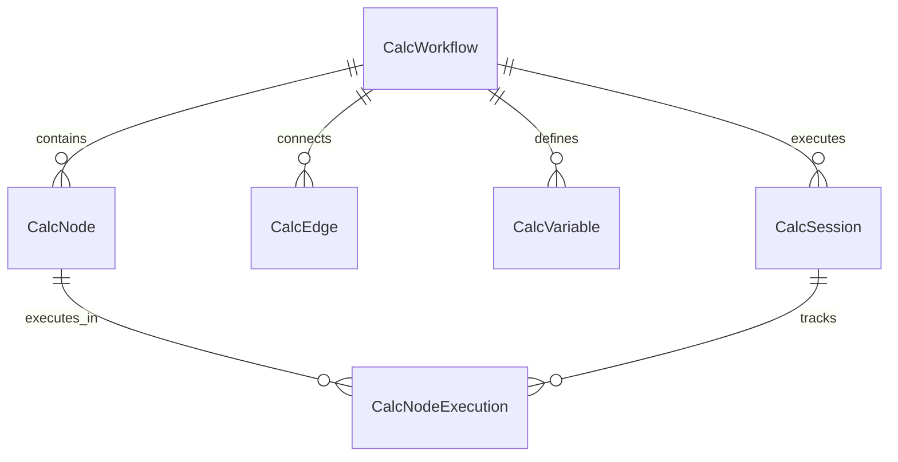
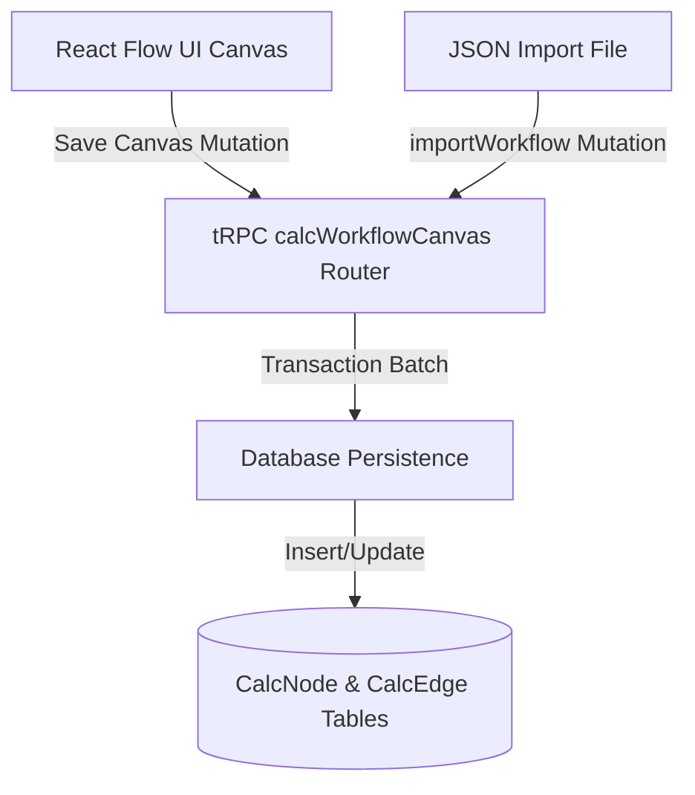
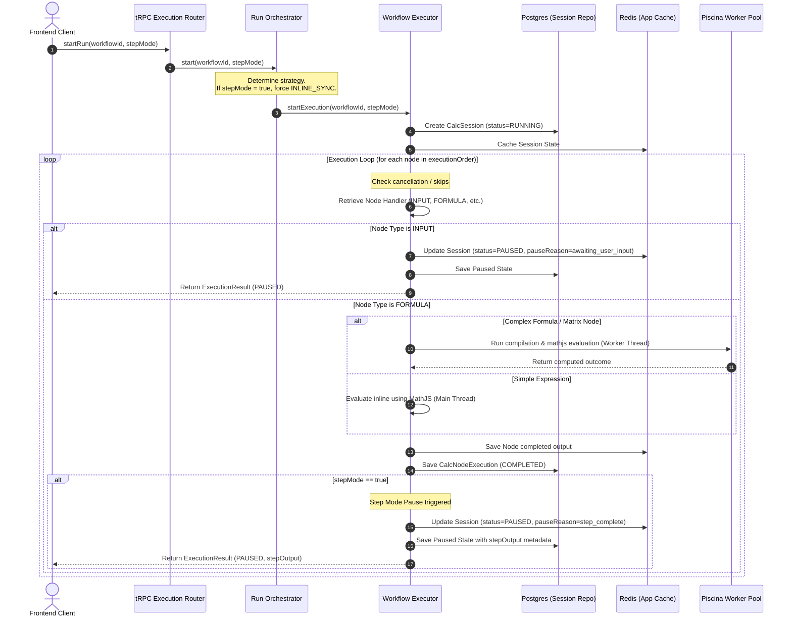

# Node Creation and Execution Flow

This document details the lifecycle of workflow nodes in Floodrix, covering how they are defined in the database, created/imported, and executed within the runtime orchestration engine (including Step Mode stepping, input waiting, worker isolation, and caching).

---

## 🗃️ 1. Database Schema

The core relational models responsible for workflow design and execution are defined in `prisma/schema.prisma`. 

### A. Workflow Structure Models

*   **`CalcWorkflow`**: Represents the workflow itself (metadata, category, published status, canvas UI layout).
*   **`CalcNode`**: Individual node instances (e.g. `INPUT`, `FORMULA`). Stores node layout and its type-specific `config` payload.
*   **`CalcEdge`**: Direct connections between nodes mapping data dependency.
*   **`CalcVariable`**: Schema definition of variables bound to the workflow (type, unit, constraints, defaults).

### B. Execution State Models

*   **`CalcSession`**: A single running instance of a workflow. Tracks current position (`currentIndex`), runtime variables (snapshot JSON), status, and pausing metadata.
*   **`CalcNodeExecution`**: Execution record of a single node in a session. Stores inputs, outputs, results, status, errors, and execution duration.

---

## 🛠️ 2. Node Creation Flow

Nodes are registered and updated in the system through two main paths:

### A. Canvas Workspace Save
1. The user drags, drops, or updates a node configuration on the React Flow UI.
2. The UI pushes state updates to the React Flow store.
3. Every modification triggers a sync via the `saveCanvasState` / `saveNode` mutations on the canvas tRPC router.
4. The router persists the updated properties directly into the `CalcNode` and `CalcEdge` Postgres tables.

### B. JSON Workflow Import (`importWorkflow`)
1. Users upload or paste a workflow definition JSON matching the dynamic spec.
2. The `importWorkflow` mutation parses and validates the schema using **Zod**.
3. It performs **ID Re-mapping**:
    * Generates new CUID IDs for every imported node and creates a mapping map: `old_json_node_id ➔ new_db_cuid`.
    * Translates all incoming edges using the mapping map to ensure structural integrity.
4. Persists nodes, edges, and variables within a single Postgres transaction.

---

## ⚡ 3. Node Execution Flow

The workflow orchestration engine coordinates execution asynchronously and inline.

### A. Run Triggering
1. The user clicks **Run Workflow** (all at once) or **Step Run** (node-by-node).
2. The frontend triggers `startRun` mutation.
3. `RunOrchestrator` determines the execution strategy:
    * If `stepMode` is `true`, it bypasses background workers (`BullMQ`) and forces `INLINE_SYNC` strategy to ensure synchronous execution, allowing user-driven pauses.
4. `WorkflowExecutor` initializes a `CalcSession` and schedules the node order based on variable dependency resolution.

### B. Core Execution Loop
1. The executor loops through nodes in `executionOrder` starting from `currentIndex`.
2. For each node, it resolves variable bindings and constructs a local mathematical scope.
3. **Execution Routing**:
    * **`INPUT` Nodes:** The input handler returns a `paused` state. The execution halts, saving the session state as `PAUSED` with reason `awaiting_user_input`.
    * **`FORMULA` Nodes (Fast path):** Simple math evaluations are evaluated synchronously in the main thread (typically takes `< 2ms`).
    * **`FORMULA` Nodes (Worker path):** If the equation includes multiline matrix operations or loops, the task is forwarded to a **Piscina Worker Pool** with a 120-second timeout to prevent CPU blocking and memory exhaustion.
4. **Step Mode Check:** After a node successfully completes, if `stepMode` is active:
    * The executor sets session status to `PAUSED` and `pauseReason` to `step_complete`.
    * It sets `currentNodeId` to the finished node.
    * It writes this update to Redis (`AppCache`) and schedules the database commit via the serializing database writer.
    * It exits the loop and returns a `PAUSED` result to the client containing `stepOutput` (the completed step results).

### C. Resuming & Stepping Forward
1. While paused on `step_complete`, the UI displays a "Step Done" card and enables the **"Step Run"** toolbar button.
2. Clicking either trigger fires the `stepForward` tRPC mutation.
3. The mutation updates the session in Redis/Postgres:
    * Increments `currentIndex` by 1.
    * Changes status to `RUNNING` and clears the pause reason.
4. The executor calls `_continueExecutionWithSession` starting from the incremented index.
5. The execution loop runs until it hits the next node and pauses again, repeating the cycle.
