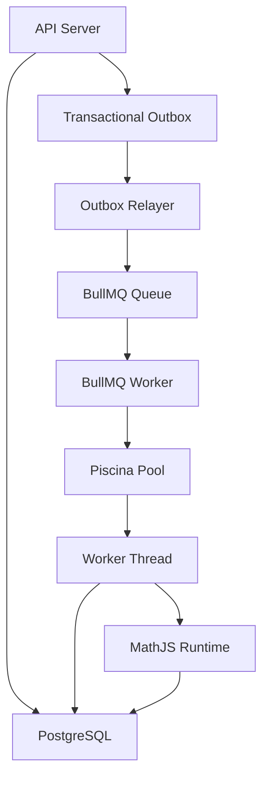

Yes. Based on all reviews, I would consider the architecture complete only after adding:

* Transactional Outbox
* Outbox watchdog recovery
* BullMQ idempotent dispatch
* Piscina worker isolation
* Checkpointing
* Batch checkpointing
* DLQ strategy
* Observability
* Redis HA notes
* Graceful shutdown
* Connection management
* Node timeout enforcement details
* Workflow timeout enforcement details
* Exact terminology corrections ("effectively-once" not "exactly-once")

Below is the structure I would ship as the final engineering RFC/MD document.

---

# Asynchronous Execution Platform Architecture

## Transactional Outbox • BullMQ • Piscina • Checkpointing • Fault Recovery

Version: 1.0

Status: Production Architecture

---

# 1. Goals

The platform must support:

* Long-running workflow execution
* User-defined MathJS formulas
* CPU-intensive calculations
* Batch processing
* Horizontal scaling
* Crash recovery
* Retry safety
* Idempotent execution
* Workflow checkpointing
* Worker isolation
* Queue durability

The architecture is designed around:

1. PostgreSQL
2. Redis
3. BullMQ
4. Piscina
5. Worker Threads

---

# 2. High-Level Architecture



---

# 3. Core Design Principles

## Principle 1

BullMQ Workers orchestrate.

They do NOT perform heavy computation.

---

## Principle 2

Piscina Worker Threads perform computation.

They do NOT manage queue orchestration.

---

## Principle 3

Database commits must be atomic with job creation.

Transactional Outbox guarantees this.

---

## Principle 4

All processing must be idempotent.

Workers may execute multiple times.

---

## Principle 5

Only IDs cross thread boundaries.

Never large datasets.

---

# 4. Redis Architecture

## Logical Database Allocation

| DB | Purpose       |
| -- | ------------- |
| 0  | Cache         |
| 1  | Sessions      |
| 2  | BullMQ        |
| 3  | Rate Limiting |

---

## BullMQ Redis Client

```ts
new Redis({
  db: 2,
  maxRetriesPerRequest: null
})
```

Required by BullMQ.

---

# 5. Transactional Outbox

## Why

Without an outbox:

```text
DB COMMIT
Queue Add
```

Server crash between operations:

```text
DB Updated
Job Missing
```

Data corruption.

---

## Solution

Inside transaction:

```text
Update Business State

Insert Outbox Record

COMMIT
```

---

# 6. Outbox Schema

```prisma
model OutboxJob {
  id String @id

  queueName String

  jobName String

  payload Json

  status OutboxStatus

  attemptCount Int

  nextRetryAt DateTime?

  lastError String?

  redisJobId String?

  enqueuedAt DateTime?

  createdAt DateTime

  updatedAt DateTime

  @@index([status,nextRetryAt,createdAt])

  @@index([status,updatedAt])
}
```

---

# 7. Outbox Relayer

Responsibilities:

1. Claim jobs
2. Dispatch jobs
3. Handle retries
4. Recover stuck jobs

---

## Claim Query

Raw SQL required.

Prisma cannot safely implement this.

```sql
FOR UPDATE SKIP LOCKED
```

Used for horizontal scaling.

---

## Dispatch

```ts
queue.add(
  job.jobName,
  payload,
  {
    jobId: job.id
  }
)
```

---

## Delivery Semantics

NOT exactly-once.

Correct terminology:

```text
At-Least-Once Delivery
+
Idempotent Processing
=
Effectively Once Results
```

---

# 8. Stuck PROCESSING Recovery

Failure scenario:

```text
Relayer claims job

PROCESSING

Server crashes
```

Job becomes stuck.

---

## Watchdog

Runs every minute.

```sql
UPDATE OutboxJob
SET status='PENDING'
WHERE status='PROCESSING'
AND updatedAt < NOW()-INTERVAL '5 minutes'
```

---

# 9. Retry Strategy

Exponential backoff.

```text
2^attempts seconds
```

Maximum:

```text
5 minutes
```

---

Maximum Attempts:

```text
20
```

After that:

```text
FAILED
```

---

# 10. Dead Letter Queue

Failed jobs must not disappear.

After retry exhaustion:

```text
FAILED
```

AND

```text
Dead Letter Queue
```

---

DLQ stores:

* Payload
* Error
* Stack Trace
* Retry Count

---

Operators can:

* Retry
* Inspect
* Archive

---

# 11. BullMQ Worker Responsibilities

BullMQ workers:

* Load execution metadata
* Start Piscina task
* Enforce timeouts
* Handle retries
* Update execution state

BullMQ workers NEVER:

* Run MathJS
* Load huge datasets
* Process matrices

---

# 12. Piscina Responsibilities

Piscina handles:

* CPU work
* Workflow execution
* Formula evaluation
* Batch processing

---

# 13. Thread Boundary Rules

Allowed:

```ts
{
  executionId
}
```

```ts
{
  workflowId
}
```

---

Forbidden:

```ts
dataset
```

```ts
workflowGraph
```

```ts
matrix
```

```ts
executionSnapshot
```

---

Reason:

IPC serialization costs.

---

# 14. Worker Thread Responsibilities

Worker thread loads:

* Workflow graph
* Variables
* Inputs
* Datasets

directly from storage.

---

Reason:

Loading 20ms from DB is cheaper than serializing 100MB through IPC.

---

# 15. Workflow Execution Model

One workflow execution equals:

```text
One Piscina Task
```

NOT

```text
One Thread Per Node
```

---

Benefits:

* Less IPC
* Better locality
* Simpler checkpoints
* Lower overhead

---

# 16. Checkpointing

Every successful node persists result.

Table:

```sql
ExecutionNodeResult
```

---

Primary Key:

```sql
PRIMARY KEY
(
 executionId,
 nodeId
)
```

---

Persist using:

```sql
ON CONFLICT
DO UPDATE
```

---

# 17. Resume Logic

Worker restart:

```text
Load checkpoints

Skip completed nodes

Continue execution
```

---

# 18. Batch Checkpointing

Batch processing:

```text
100,000 rows
```

Chunked:

```text
100 rows
```

---

Checkpoint:

```sql
executionId
chunkNumber
lastProcessedRow
```

---

Crash:

```text
Resume from last chunk
```

Not beginning.

---

# 19. Node Timeouts

Node timeout protects against:

```text
Infinite loops
Huge formulas
Runaway calculations
```

---

Important:

JavaScript cannot interrupt synchronous CPU work.

---

Therefore:

```text
Timeout
=
Thread Termination
```

---

# 20. Node Timeout Enforcement

BullMQ Worker:

```ts
Promise.race([
 piscina.run(),
 timeout()
])
```

Timeout wins:

```text
Terminate Worker Thread
```

---

Execution marked:

```text
FAILED
```

or

```text
RETRY
```

depending on policy.

---

# 21. Workflow Timeout

Separate from node timeout.

Example:

```text
Node Timeout:
30 seconds

Workflow Timeout:
10 minutes
```

---

Purpose:

Prevent infinite workflow chains.

---

# 22. Worker Failure Isolation

Required:

```ts
try {
 await piscina.run()
}
catch(e) {
 ...
}
```

Guarantee:

```text
Workflow Failure
≠
Worker Failure
```

---

# 23. Database Connections

Worker threads load data directly.

Each worker thread:

```text
1 database connection
```

recommended.

---

Example:

```text
16 CPU cores
16 worker threads
16 DB connections
```

Safe.

---

Large deployments:

```text
PgBouncer
```

recommended.

---

# 24. MathJS Security Model

MathJS is NOT a security boundary.

Actual isolation:

```text
Node Worker Thread
```

---

Use allowlist.

NOT denylist.

---

Allowed:

```text
sqrt
pow
sin
cos
log
multiply
divide
```

---

Everything else disabled.

---

# 25. Runtime Limits

Worker thread enforces:

### Matrix Limit

```text
1,000,000 elements
```

---

### Workflow Depth

Configurable.

---

### Node Count

Configurable.

---

### Execution Time

Configurable.

---

# 26. Redis High Availability

Redis failure stops queue execution.

Outbox prevents data loss.

But execution pauses.

---

Production:

Use:

```text
Redis Sentinel
```

or

```text
Redis Cluster
```

---

# 27. Observability

Required metrics.

---

## Queue Metrics

* Queue depth
* Active jobs
* Failed jobs
* Delayed jobs

---

## Outbox Metrics

* Pending count
* Processing count
* Failed count
* Relayer lag

---

## Piscina Metrics

* Active threads
* Busy threads
* Queue wait time
* Task duration

---

## Workflow Metrics

* Node duration
* Workflow duration
* Timeout count
* Retry count

---

# 28. Logging

Every execution logs:

```text
executionId
workflowId
nodeId
attempt
duration
status
```

---

Structured JSON logging required.

---

# 29. Graceful Shutdown

Deployment scenario:

```text
Kubernetes rollout
```

Worker receives SIGTERM.

---

Required sequence:

```text
Pause BullMQ

Stop fetching jobs

Wait for Piscina tasks

Close connections

Exit
```

---

Never terminate active workflows abruptly.

---

# 30. Horizontal Scaling

Supported:

```text
Multiple API Servers
```

```text
Multiple Relayers
```

```text
Multiple BullMQ Workers
```

```text
Multiple Piscina Pools
```

---

Coordination:

```sql
FOR UPDATE SKIP LOCKED
```

and

```text
BullMQ Redis Locks
```

---

# 31. System Guarantees

| Guarantee                | Supported |
| ------------------------ | --------- |
| Atomic Job Creation      | Yes       |
| Worker Isolation         | Yes       |
| Crash Recovery           | Yes       |
| Retry Safety             | Yes       |
| Checkpoint Resume        | Yes       |
| Horizontal Scaling       | Yes       |
| Batch Resume             | Yes       |
| DLQ                      | Yes       |
| Graceful Shutdown        | Yes       |
| Redis HA Support         | Yes       |
| Effectively Once Results | Yes       |
| Exactly Once Delivery    | No        |

---

# 32. Final Architecture Summary

The system follows:

```text
PostgreSQL
    ↓
Transactional Outbox
    ↓
Outbox Relayer
    ↓
BullMQ
    ↓
BullMQ Worker
    ↓
Piscina Pool
    ↓
Worker Thread
    ↓
MathJS Runtime
    ↓
Checkpoint Persistence
```

This architecture provides:

* Durable execution
* Horizontal scalability
* Failure isolation
* Checkpoint recovery
* Safe retries
* Long-running workflow support
* Batch processing support
* Production-grade observability
* Operational resilience

while keeping CPU-intensive computation completely isolated from the Node.js event loop.
