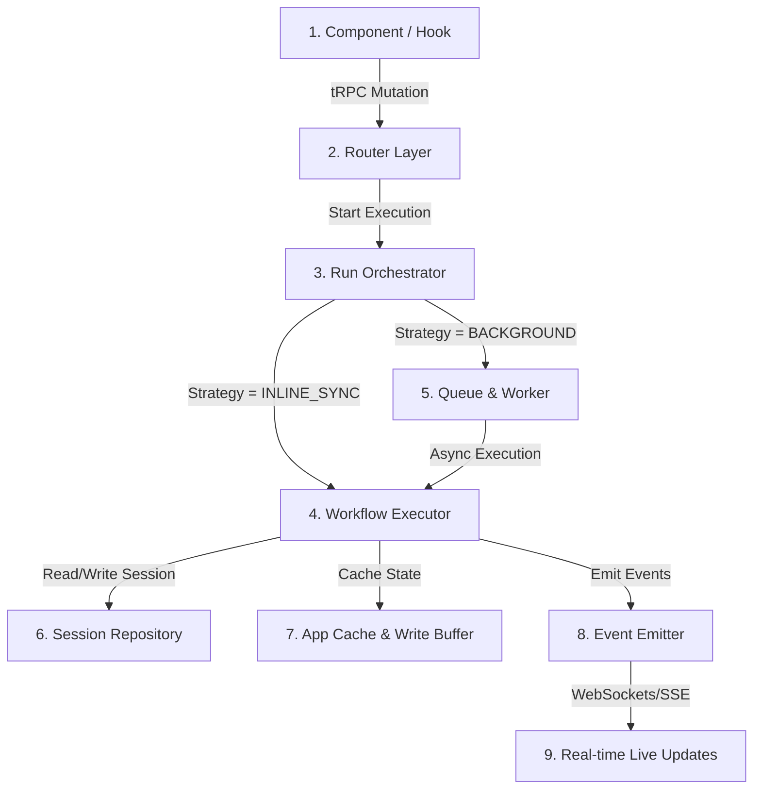

# Floodrix Workflow Execution Trace

This document provides a highly detailed, step-by-step code execution trace of what happens when a workflow run is triggered in Floodrix. It maps every file, class, method, and function from the frontend UI interaction down to the database persistence, real-time WebSocket progress broadcasts, and asynchronous workers.

---

## 🗺️ Execution Architecture Overview

---

## 🧵 Phase 1: Frontend Trigger & Subscription
The execution lifecycle begins on the client side when a user clicks the run trigger (e.g., **"Run All"** or **"Step Run"**).

### 1. `workflow-runner.tsx` (Component)
*   **File Path:** `/src/features/workflow-canvas/components/workflow-runner.tsx`
*   **Trigger Elements:**
    *   **"Step Run" Button (Toolbar):** Lines 366–382. Resolves `exec.isStepPause` to either step forward or start a new run in step mode.
    *   **"Run All" Button (Toolbar):** Lines 383–400. Triggers `exec.startRun({ stepMode: false })` to execute the whole workflow.
    *   **"Continue" Button (Node Card):** Lines 678–696. Renders inside the `StepPauseForm` on the active node and calls the `stepForward` callback.
*   **Action:** Invokes methods exposed by the `useExecution` hook.

### 2. `use-execution.ts` (React Hook)
*   **File Path:** `/src/features/workflow-canvas/hooks/use-execution.ts`
*   **Key Functions:**
    *   **`startRun(opts)` (Line 312):** Clears previous canvas highlights, resets status to `RUNNING`, and executes `startMutation.mutate(...)`.
    *   **`stepForward()` (Line 331):** Triggers `stepForwardMutation.mutate({ sessionId })`.
    *   **`progressSubscription` (Line 210):** Subscribes to tRPC WebSocket route `subscribeProgress` for real-time events. Upon receiving `NODE_STARTED`, `NODE_COMPLETED`, or `SESSION_PAUSED`, it updates the React local state (`setState`) and highlights node states on the canvas.

---

## 🔌 Phase 2: tRPC Router Layer
tRPC handles incoming client mutations and resolves contexts, acting as the gateway to the backend.

### 3. `execution-router.ts` (API Router)
*   **File Path:** `/src/features/workflow-canvas/server/execution-router.ts`
*   **Key Procedures:**
    *   **`startRun` (Line 83):**
        1. Calls `loadContext(prisma, userId, { workflowId })` to verify access.
        2. Creates `CalcContext(prisma, actorId, orgId)`.
        3. Instantiates `RunOrchestrator`.
        4. Calls `orchestrator.start(...)`.
    *   **`stepForward` (Line 251):**
        1. Loads session context.
        2. Creates `WorkflowExecutor` passing `liveUpdates: true`.
        3. Calls `executor.stepForward(sessionId)`.

---

## 🚦 Phase 3: Run Orchestrator & Strategy Selection
Before a workflow runs, the system determines the best execution path based on the node types and options.

### 4. `RunOrchestrator.ts` (Orchestrator)
*   **File Path:** `/src/server/engine/RunOrchestrator.ts`
*   **Key Functions:**
    *   **`start(input)` (Line 59):**
        1. Performs idempotency check using `repo.findByIdempotencyKey(...)`.
        2. Identifies all node types in the workflow.
        3. Invokes `resolver.resolve(...)` to pick execution strategy. If `stepMode` is active, it overrides and forces `INLINE_SYNC` strategy.
    *   **`runInlineSync(...)` (Line 104):** Calls `executor.startExecution(...)` inside the current request thread.
    *   **`runBackground(...)` (Line 125):** 
        1. Resolves topology via `resolveExecutionOrder`.
        2. Creates a record in the database `CalcSession` with status `PENDING`.
        3. Enqueues a start background job in BullMQ via `QueueProducer.dispatchCalcStartBackground(...)`.
        4. Returns an `asyncPending` poll payload immediately to the client.

---

## ⚙️ Phase 4: Core Execution Engine
The `WorkflowExecutor` executes the workflow step-by-step, manages variable scopes, timeouts, and pauses.

### 5. `WorkflowExecutor.ts` (Engine)
*   **File Path:** `/src/server/engine/WorkflowExecutor.ts`
*   **Key Functions & Execution Path:**
    *   **`startExecution(calcWorkflowId, actorId, initialValues, options, idempotencyKey)` (Line 228):**
        1. Runs topological sort: `resolveExecutionOrder(wf)` to establish execution order.
        2. Populates default variables and overrides them with `initialValues`.
        3. Invokes `repo.createSession(...)` to persist session structure to the database.
        4. Emits `session:started` event.
        5. Calls the private core runner loop `_continueExecutionWithSession(session, options)`.
    *   **`stepForward(sessionId, options)` (Line 442):**
        1. Loads active session from Redis cache.
        2. Verifies status is `PAUSED` and reason is `step_complete`.
        3. Sets status to `RUNNING`, clears `pauseReason`, and increments `currentIndex` by 1.
        4. Triggers background persistence of the new index to Postgres via `WriteSerializer`.
        5. Re-enters loop: `_continueExecutionWithSession(updatedSession, { stepMode: true, liveUpdates: true, bypassLock: true })`.
    *   **`_continueExecutionWithSession(session, options)` (Line 596) - Core Loop:**
        1. **Concurrency Lock:** Obtains a session concurrency lock `repo.acquireExecutionLock(...)`.
        2. **Buffer Registry:** Registers active session with `WriteBufferManager` if `liveUpdates` is active.
        3. **Loop:** Runs a `while` loop starting from `currentIndex` through `executionOrder.length`:
            *   Checks cancellation status from the DB.
            *   Skips node if it is marked in `metadata.skippedNodes` or if structural skip conditions match.
            *   Fetches the node execution handler: `deps.registry.get(node.type)`.
            *   Emits the `node:started` event to trigger front-end progress highlights.
            *   Prepares `ExecutionContext` containing a `DefaultVariableStore` snapshot.
            *   Evaluates node using `runHandlerWithTimeout(handler, ctx)` (see Phase 5).
            *   **Errored Outcome:** Stores status as `ERRORED`, cleans Redis cache, calls `errorOut(...)` to record the failure, releases the lock, and returns.
            *   **Paused Outcome (INPUT Nodes):** Sets status to `PAUSED` and reason to `awaiting_user_input`. Commits progress, updates Redis, emits `session:paused`, and returns immediately.
            *   **Completed Outcome (FORMULA Nodes):**
                *   Resolves mathematical output, maps outcomes to the global variable store, and enriches output with markdown templates.
                *   Emits `node:completed` progress event.
                *   Pushes completion state to the database and enqueues progress tracking updates to `WriteBufferManager`.
            *   **Step Mode Pause Check:** If `stepMode` is active, it forces an early exit:
                *   Pushes status `PAUSED` and reason `step_complete` to Redis and Postgres.
                *   Sets `currentNodeId` to the finished node.
                *   Emits `session:paused` progress event.
                *   Returns the execution result to pause the cycle.

---

## 🧵 Phase 5: Math & Worker Isolation
Calculations run inside isolated environments depending on their complexity.

### 6. `runHandlerWithTimeout(...)` inside `WorkflowExecutor.ts`
*   **Inline Execution (Main Thread):** Evaluates mathematical expressions synchronously using **MathJS** for quick operations.
*   **Worker Pool Isolation (Piscina):**
    *   If a node has `use_worker: true` or executes multiline blocks containing matrix allocations, the execution context is serialized.
    *   It is passed to the Piscina Worker Pool defined in `/src/workers/calcWorker.ts`.
    *   The worker executes calculations under a **120-second timeout** and enforces OOM memory safety ceilings to protect the main application process.

---

## 🗄️ Phase 6: State Persistence & Cache Layer
Floodrix uses a hybrid database and caching layer to prevent Postgres write bottlenecks while keeping execution fast.

### 7. `AppCache.ts` (Redis Cache)
*   **File Path:** `/src/server/engine/AppCache.ts`
*   **Usage:**
    *   Updates real-time running status (`setSessionStatus`).
    *   Retrieves session snapshots quickly without querying Postgres (`getSessionState`, `setSessionState`).
    *   Caches completed node steps (`getSessionExecutions`, `setSessionExecutions`).

### 8. `WriteBufferManager.ts` (Write Buffer)
*   **File Path:** `/src/server/engine/WriteBufferManager.ts`
*   **Usage:** Piles up multiple intermediate variable updates inside Redis. Only flushes the final snapshot to Postgres when the buffer threshold is reached or when a pause/completion occurs, reducing database write IO.

### 9. `SessionRepository.ts` (Postgres Persistence)
*   **File Path:** `/src/server/engine/SessionRepository.ts`
*   **Key Functions:**
    *   `createSession(...)`: Inserts a `CalcSession` database record.
    *   `updateNodeCompleted(...)`: Creates/updates a `CalcNodeExecution` database record.
    *   `pauseSession(...)`: Persists session as `PAUSED` and saves current coordinates.
    *   `resumeSession(...)`: Resets status to `RUNNING` in the database.

---

## 📡 Phase 7: Event Broadcasting (SSE / WebSockets)
To notify the React canvas UI of progress in real time, the engine broadcasts execution events.

### 10. `ExecutionEventEmitter.ts` (Event Broker)
*   **File Path:** `/src/server/engine/listeners/ExecutionEventEmitter.ts`
*   **Usage:** Receives runtime execution events from the executor.

### 11. `DatabaseListener.ts` (Database Listener)
*   **File Path:** `/src/server/engine/listeners/DatabaseListener.ts`
*   **Usage:** Subscribes to the `ExecutionEventEmitter`. When a node finishes or pauses, it acts as a dispatcher:
    1. Writes events to databases for historical storage.
    2. Broadcasts events to the WebSocket server context (making progress immediately visible to the frontend's `progressSubscription` stream).
